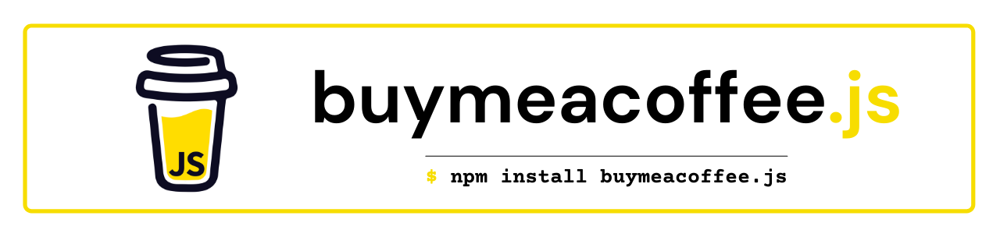

# BuyMeaCoffee.JS 

     

A simple and lightweight but powerful **official Node.JS client** for **[Buy Me A Coffee](https://buymeacoff.ee/?via=WarenGonzaga) API**.

## ⚡ Features

- Simple Usage
- Lightweight
- Supporters Data
- Subscriptions Data
- Extras Data
- Supports NodeJS v10+ LTS

## 📖 Documentation

Check out the official and complete documentation here.

## 🎯 Contributing

Contributions are welcome, create a pull request to this repo and I will review your code. Please consider to submit your pull request to the `dev` branch. Thank you!

Read the project's [contributing guide](./contributing.md) for more info.

## 💬 Discussions

For any questions, suggestions, ideas, or simply you want to share your experience in using this project, feel free to share and discuss it to the [community](https://github.com/warengonzaga/buymeacofee.js/discussions)!

## 🐛 Issues

Please report any issues and bugs by [creating a new issue here](https://github.com/warengonzaga/buymeacoffee.js/issues/new/choose), also make sure you're reporting an issue that doesn't exist. Any help to improve the project would be appreciated. Thanks! 🙏✨

## 🍀 Sponsors

> Love what I do? Send me some [love](https://github.com/sponsors/warengonzaga) or [coffee](https://buymeacoff.ee/warengonzaga)!? 💖☕
>
> Can't send love or coffees? 😥 Nominate me for a **[GitHub Star](https://stars.github.com/nominate)** instead!
> Your support will help me to continue working on open-source projects like this. 🙏😇

## 🌏 Community

Join to the official Buy Me a Coffee Discord community server!

Join to my growing tech community and get the latest updates!

## 📋 Code of Conduct

Read the project's [code of conduct](./code_of_conduct.md).

## 📃 License

BuyMeaCoffeeJS is licensed under [The MIT License](https://opensource.org/licenses/MIT).

## 📝 Author

BuyMeaCoffeeJS is created by **[Waren Gonzaga](https://github.com/warengonzaga)**, with the help of awesome [contributors](https://github.com/warengonzaga/buymeacoffee.js/graphs/contributors).

---

💻💖☕ by [Waren Gonzaga](https://warengonzaga.com) | [YHWH](https://youtu.be/9vh6Dz9oh8I?t=85) 🙏