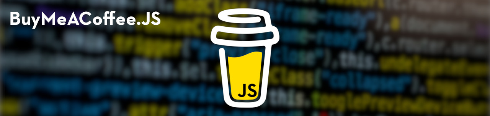

# BuyMeACoffee.JS [](https://openbase.com/js/buymeacoffee.js?utm_source=embedded&utm_medium=badge&utm_campaign=rate-badge) [](https://huntr.dev)

[](https://github.com/warengonzaga) [](https://wrngnz.ga/discord) [](https://github.com/warengonzaga/buymeacoffee.js/releases) [](https://github.com/warengonzaga/buymeacoffee.js/stargazers)   [](https://github.com/warengonzaga/buymeacoffee.js/blob/main/LICENSE)



A simple and lightweight but powerful Node.js client for [Buy Me A Coffee](https://buymeacoff.ee/?via=WarenGonzaga) API.

## 😎 Demo

(coming soon...)

## ⚡ Features

- Simple Usage
- Lightweight
- Supporters Data
- Subscriptions Data
- Extras Data
- Supports NodeJS v10+ LTS

## 📖 Documentation

Check out the official and complete documentation here.

[](https://docs.warengonzaga.com/buymeacoffeejs)

## 🎯 Contributing

Contributions are welcome, create a pull request to this repo and I will review your code. Please consider to submit your pull request to the ```dev``` branch. Thank you!

Read the project's [contributing guide](./CONTRIBUTING.md) for more info.

## 💬 Discussions

For any questions, suggestions, ideas, or simply you want to share your experience in using this project, feel free to share and discuss it to the [community](https://github.com/warengonzaga/suspend-wp/discussions)!

## 🐛 Issues

If you're facing a problem in using BuyMeaCoffeeJS please let me know by [creating an issue here](https://github.com/warengonzaga/suspend-wp/issues/new). I'm here to help you!

## 🍀 Sponsors and Supporters

[](https://buymeacoff.ee/warengonzaga) [](https://vercel.com) [](https://vercel.com) [](https://gitbook.io) [](https://digitalocean.com) [](https://deepware.ai/) [](https://nowpayments.io) [](https://stackhawk.com)

<!-- markdownlint-disable MD033 -->
> Love what I do? **[Send me some coffees](https://buymeacoff.ee/wareneutron)**!<br/>
> Your coffee donation and support will help me to continue working on open-source projects like this.
<!-- markdownlint-disable MD033 -->

## 🌏 Community

Join to the official Buy Me a Coffee Discord community server!

[](https://discord.gg/GFBQvyEJ98)

Join to my growing tech community and get the latest updates!

[](https://wrngnz.ga/discord) [](https://wareneutron.com/discord)

## 📋 Code of Conduct

Read the project's [code of conduct](./code_of_conduct.md).

## 📃 License

BuyMeaCoffeeJS is licensed under [The MIT License](https://opensource.org/licenses/MIT).

## 📝 Author

BuyMeaCoffeeJS is created by **[Waren Gonzaga](https://github.com/warengonzaga)**, with the help of awesome [contributors](https://github.com/warengonzaga/emily.css/graphs/contributors).

---

💻 Made with 💖 and ☕ by **Waren Gonzaga** with **YHWH** 🙏 | Citizen of Heaven

[personal website]: https://warengonzaga.com
[business website]: https://wgcompanyhq.com
[biolink]: https://bio.link/warengonzaga
[facebook]: https://facebook.com/warengonzagaofficial
[twitter]: https://twitter.com/warengonzaga
[instagram]: https://instagram.com/warengonzagaofficial
[youtube]: https://youtube.com/warengonzaga
